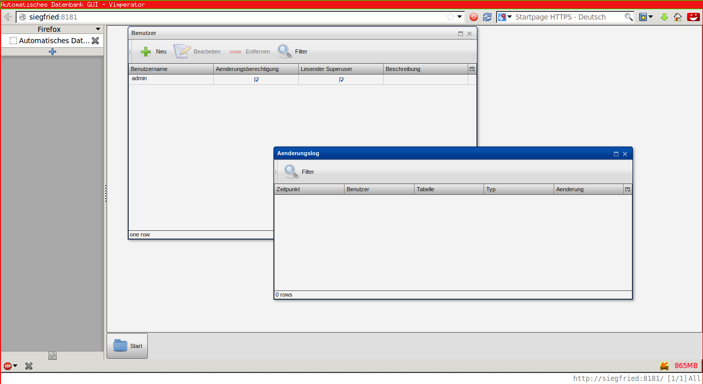

# ADBGUI

The ADBGUI Framework allows you to easily create a custom Web-Gui for your database. 

For office people you can say its a lightweight, extensible opensource  M$ Access in the browser.


## Official Documentation
* http://www.adbgui.org/    
* http://www.adbgui.org/lib/exe/detail.php?id=start&media=howto:screenshot.jpg

## Supported Databases
* MySQL
* PostgreSQL
* csv files


## Installation on Debian GNU/Linux:

```bash
# The name of your database frontend empowerd with ADBGUI
export PROJECTNAME=myproject

# Dependencies: git, sudo

# clone to local folder
git clone https://github.com/pRiVi/ADBGUI.git $PROJECTNAME
# If you have an ssh account loaded on github:
# git clone git@github.com:pRiVi/ADBGUI.git $PROJECTNAME
cd $PROJECTNAME

# If you want to use the qooxdoo feature   : paramter "qx"
# If you do not want apache to be installed: paramter "noap"
install/installscript qx noap

# install all wanted modules, to start a new module you might
# want to install a skeleton:
perl install/skeleton.pl $PROJECTNAME

# reconfiure your project activating all installed modules
install/reconfig.debian.sh
```
## Usage
Your Project now already works with basic configuration.
Start your database Frontend with:
```bash
perl dbm.pl
```
* Per default your Database Frontend listens on Port 8181
  * can be changed in dbm.cfg
* Pre defined user:      admin
* Pre defined password: "bitteaendern"

Beeing logged in as admin you can access the standard Framework functionalities which is:
* add/change Users and their permissions
* view the built in log
* view live statistics

### Screenshot

The interface for normal Users looks exactly the same, with the difference,
that they can't access the user or log table.


## Customization
To customize your Software, edit the module slices files
in the subfolder `$PROJECTNAME` of the installation.  
Like:
* `$PROJECTNAME/DBDesign.pm` for your database tables and linkings.
* `$PROJECTNAME/Qooxdoo.pm ` for GUI customizations.
* `$PROJECTNAME/DBManager.pm` for additional business logic.  

Those so called "Slices" or "Slice Modules" get loaded after the Framework modules, use them
and can customize their functionality.   
See the diagrams in Documentation Folder for further Info about the ADBGUI Modules and our slicing approach.
